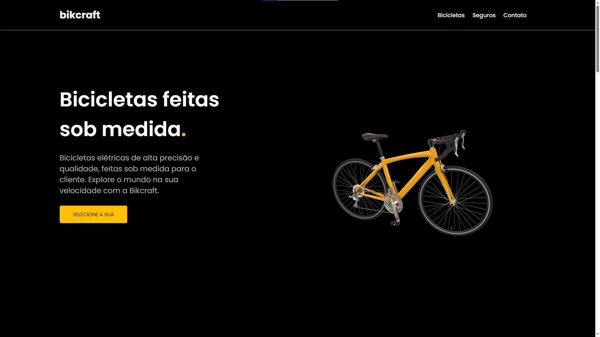
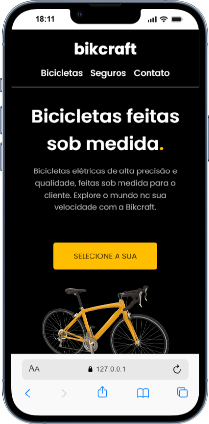

<h1 align="center"> Bikcraft </h1>

Projeto feito para aprendizado próprio.

  <a href="#-tecnologias">Tecnologias</a>&nbsp;&nbsp;&nbsp;|&nbsp;&nbsp;&nbsp;
  <a href="#-projeto">Projeto</a>&nbsp;&nbsp;&nbsp;|&nbsp;&nbsp;&nbsp;
  <a href="#memo-licença">Licença</a>

  

 
<h1 align="center"> Previews </h1>

  

  

## 🚀 Tecnologias

Esse projeto foi desenvolvido com as seguintes tecnologias:

- HTML e CSS
- JavaScript
- Git e Github

## 💻 Projeto

O Bikcraft Clone é uma recriação do site Bikcraft feita a partir de uma única imagem. Eu não sabia que o site realmente existia até terminar o projeto, por isso ele não ficou idêntico ao original.  
Bikcraft Clone is a recreation of the Bikcraft website that I built from a single image. I didn’t know the real site actually existed until I finished the project, so it’s not perfectly identical to the original.
